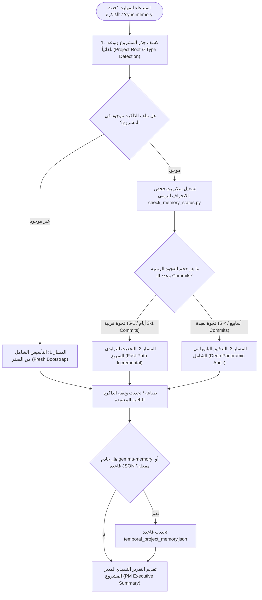

# Universal Architectural Memory Keeper (حارس ومنعش الذاكرة المعمارية الشامل)

> **الغرض العام:** مهارة معمارية شاملة قابلة للتطبيق على **أي مشروع برمجيات** (Flutter, React, Node.js, Python, Go, Rust, إلخ). تضمن توثيق القرارات المعمارية العليا، والثوابت غير القابلة للتفاوض، والأخطاء السابقة لتفادي تكرارها، وتاريخ الإنجازات الحقيقية من واقع الـ Git، ليدخل أي ذكاء اصطناعي جديد المشروع وهو يعلم كل شيء وكأنه كان شريكاً في كل خطوة.

---

## 🧭 بروتوكول التشغيل ثلاثي المسارات (Universal 3-Path Protocol)



---

## 🔍 الخطوة 1: كشف بيئة المشروع وانجراف الذاكرة (Drift Detection)

يقوم الوكيل بتشغيل أداة الفحص العامة المستقلة:
```powershell
python -X utf8 .agents/skills/architectural-memory-keeper/scripts/check_memory_status.py
```
*(أو مسارها العام إن وُجدت في بيئة Antigravity)*.

تقوم الأداة تلقائياً بـ:
1. استكشاف جذر المشروع ديناميكياً عبر `git rev-parse --show-toplevel`.
2. استكشاف اسم المشروع ونوعه من ملفات الحزم وإعدادات البناء (`settings.gradle.kts`, `build.gradle.kts`, `pubspec.yaml`, `package.json`, `Cargo.toml`, `pyproject.toml`).
3. البحث عن ملف الذاكرة عبر المسارات القياسية:
   - `.specify/memory/project_memory.md` (المسار الموصى به)
   - `.memory/project_memory.md`
   - `memory/project_memory.md`
   - `project_memory.md`
4. حساب الفجوة الزمنية (عدد الأيام) وعدد الـ Commits الجديدة منذ آخر توثيق.
5. تحديد المسار الأنسب تلقائياً (مسار 1 أو 2 أو 3).

---

## 🛠️ تفاصيل المسارات التنفيذية الثلاثة

### 📁 المسار 1: التأسيس الشامل من الصفر (Fresh Bootstrap)
**يُطبق إذا كان المشروع لا يحتوي على ملف ذاكرة بعد:**
1. استدعِ القالب المرجعي العام:
   [`references/memory_template.md`](./references/memory_template.md).
2. اقرأ قواعد المشروع وملفات الإرشادات المتاحة (`AGENTS.md`, `README.md`, `constitution.md`).
3. افحص سجل الـ Git لتاريخ المشروع:
   `git log --oneline -n 30`
4. أنشئ ملف الذاكرة في المسار القياسي [`.specify/memory/project_memory.md`](.specify/memory/project_memory.md) بالهيكلية الثلاثية:
   - **القسم الأول:** الثوابت المعمارية وخيارات المدير المحسومة (Non-Negotiables).
   - **القسم الثاني:** الأخطاء والدروس المستفادة المحظور تكرارها (Hard-Learned Lessons).
   - **القسم الثالث:** السجل الزمني المركز للإنجازات (Milestone Decision Log).

---

### ⚡ المسار 2: التحديث التزايدي السريع (Fast-Path Incremental)
**يُطبق إذا كان آخر توثيق قريباً والتغييرات محصورة في بضعة أيام أو عدد قليل من الـ Commits:**
1. استعرض الـ Commits الحديثة فقط:
   `git log --since="<LAST_DATE>" --stat`
2. افحص المحادثات الأخيرة في سجلات الـ Brain أو رسائل الجلسة الحالية لمعرفة ما تم الاتفاق عليه مع المدير.
3. أضف الـ Commits الجديدة في مقدمة **القسم الثالث** بملف الذاكرة.
4. إذا تم حل علة برمجية خطيرة أو كسر نمط سابق، وثقها فوراً في **القسم الثاني** (الدروس المستفادة).
5. حدث تاريخ آخر تدقيق في رأس الملف.

---

### 🔍 المسار 3: التدقيق البانورامي الجراحي (Deep Panoramic Audit)
**يُطبق إذا كان آخر توثيق قديماً أو بعد فترة عمل طويلة تراكمت فيها عشرات التعديلات:**
1. استخرج السجل الكامل لجميع الـ Commits منذ آخر تحديث:
   `git log --since="<LAST_DATE>" --oneline`
2. حلل الملفات الجوهرية المتأثرة عبر الطبقات (قواعد البيانات، المنطق، الواجهات):
   `git log --since="<LAST_DATE>" --stat`
3. تفحص الـ Commits الاستراتيجية الكبرى:
   `git show <HASH> --stat`
4. استخلص الإنجازات المعمارية وصِغها بأسلوب هندسي دقيق مع ذكر الملفات المتأثرة وأثرها على النظام.
5. استخرج أي أخطاء أو دروس مستفادة استجدت وأدرجها في القسم الثاني.
6. إذا كانت قاعدة `temporal_project_memory.json` مستخدمة في البيئة، احقن الإنجازات الجديدة فيها بالمخطط القياسي.

---

## 📋 معايير الصياغة الذهبية للذاكرة (Universal Best Practices)

1. **لغة القيمة والوضوح (Caveman / PM Focus):** الصياغة يجب أن تشرح "ماذا يقدم التعديل ولماذا تم اختياره" بدلاً من الحشو البرمجي.
2. **النزاهة والمطابقة مع الكود الحقيقي (Ground Truth):** لا توثق إلا ما تم اعتماده ودمجه فعلياً في الكود؛ احذر توثيق التجارب الفاشلة أو المؤقتة إلا كدروس مستفادة محظور تكرارها.
3. **الربط بالملفات المتأثرة:** كل إنجاز يجب أن يوضح بدقة ما هي الملفات أو الطبقات التي بُني عليها.
4. **منع التلوث:** لا تسمح أبداً بدخول نصوص التفكير أو القوالب الفارغة مثل `string` إلى ملف الذاكرة.

---

## 🎯 التقرير النهائي لمدير المشروع (PM Deliverable)

بعد انتهاء العملية، يكتب الوكيل ملخصاً سريعاً ومباشراً للمدير:
1. **المسار المنفذ:** (تأسيس من الصفر / تحديث سريع / تدقيق بانورامي).
2. **الفترة المغطاة:** من تاريخ [X] إلى تاريخ [Y].
3. **عدد الإنجازات الجديدة:** [N] إنجازاً معمارياً موثقاً.
4. **أبرز القرارات والدروس المستفادة التي تم تثبيتها.**
