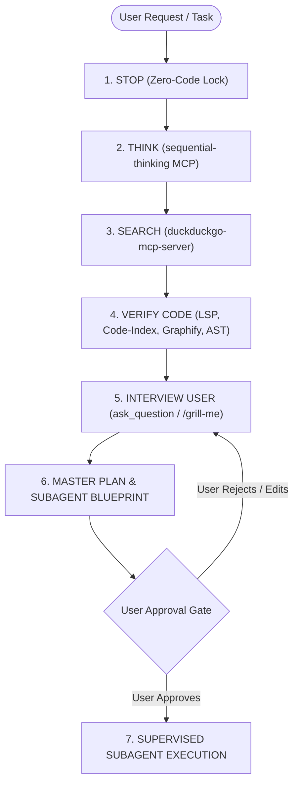

# 🛑 Stop, Think, Search and Plan (توقف، فكّر، ابحث وخطّط)

> **Core Philosophy**: Never write a single line of code until you have thought rigorously, searched thoroughly, verified existing code, grilled the user on every ambiguity, constructed an airtight plan, decomposed work into supervised subagents, and obtained explicit user approval.

---

## 🚫 The Iron Rule: ZERO CODE & STRICT GATE (القانون الحديدي)

When this skill is active in a conversation:
1. **ABSOLUTE CODE BAN**: You are **STRICTLY PROHIBITED** from calling `write_to_file`, `replace_file_content`, or running modifying/destructive shell commands on project source code during the planning phase.
2. **NO EXECUTION WITHOUT EXPLICIT PERMISSION**: You MUST NOT start any execution, code generation, or subagent implementation until the user explicitly reviews the plan and provides unequivocal approval (e.g. *"ابدأ"*, *"نفذ"*, *"Approved"*, *"Proceed"*).
3. **READ-ONLY EXPLORATION & ARTIFACTS ONLY**: You may only read files, search the web, query MCP servers, ask clarifying questions, and write plan/walkthrough artifacts (`implementation_plan.md`).

---

## 🧭 The 6-Stage Pre-Flight Blueprint



---

## 🛑 المرحلة 1: STOP (توقف تماماً وقفل أدوات التعديل)
- Acknowledge the mode immediately.
- Lock down all code editing tools (`write_to_file`, `replace_file_content`).
- Enter **Planning Mode** and set context to pure discovery and architecting.

---

## 🧠 المرحلة 2: THINK (`thinking mcp` / `sequential-thinking`)
Before jumping to solutions, engage deliberate reasoning via `sequential-thinking`:

1. Call `call_mcp_tool` with `ServerName: "sequential-thinking"`, `ToolName: "sequentialthinking"`.
2. **Mandatory Non-Linear Exploration**:
   - Break down the problem into atomic logical components.
   - Generate at least **2 alternative architectural approaches** using `branchFromThought` and `revisesThought`.
   - Evaluate trade-offs, state persistence, backward compatibility, and complexity.
3. **Mandatory 3-Failure-Mode Red-Teaming**:
   - Identify 3 ways this feature/change could fail, cause race conditions, corrupt state, or introduce regressions.
   - Design explicit preventative mitigations for each failure mode.

---

## 🔍 المرحلة 3: SEARCH (`duckduckgo-mcp-server` & Official Docs)
Gather ground truth from external documentation and ecosystem best practices:

1. Call `call_mcp_tool` with `ServerName: "duckduckgo-mcp-server"`, `ToolName: "search"` / `ToolName: "fetch_content"` (or `search_web`).
2. Search queries must focus on:
   - Official library APIs, deprecations, and breaking changes in target package versions.
   - Best practices for the requested feature (e.g. Jetpack Compose recomposition, Room SQLite transactions, Media3 ExoPlayer hooks, NewPipeExtractor resilient parsing).
   - Proven UI/UX and architectural patterns for similar requirements.

---

## 🔬 المرحلة 4: VERIFY EXISTING CODE (التأكد الجراحي من الكود الحالي)
Inspect the codebase thoroughly using surgical tools (strictly avoiding blind file reading):

```
[Tier 1: Graphify]        ===> Map System Topology, Callers & Blast Radius
[Tier 2: Code-Index]      ===> Surgical Symbol Extraction (get_symbol_body)
[Tier 3: ast-grep]        ===> Structural AST Pattern Matching across files
[Tier 4: Code-Index/AST]  ===> Semantic Hierarchy, Compiler Diagnostics & References
[Tier 5: grep_search]     ===> LAST RESORT ONLY for unindexed raw strings
```

1. **Topology & Blast Radius**: Check `graphify` / knowledge graph for upstream callers and downstream dependents.
2. **Surgical Extraction**: Use `code-index-mcp` (`get_symbol_body`, `search_code_advanced`) to inspect functions without token bloat.
3. **Type & Reference Check**: Use `code-index-mcp` / `ast-grep` to verify contracts and callers.
4. **End-to-End Trace**: Trace data flow across all layers:
   - **UI Layer**: Jetpack Compose (@Composable), RTL layout, and `PureTheme.colors.*` single source of truth.
   - **State Layer**: ViewModel, StateFlow / SharedFlow, Coroutine lifecycles, and caching.
   - **Domain & Repo Layer**: Repository contracts and extractor bridges.
   - **Data Layer**: Room SQLite entities, DAOs, `@Transaction`, and NewPipeExtractor bridges.

---

## 🎙️ المرحلة 5: INTERVIEW USER via `/grill-me` (`ask_question`)
Never assume underspecified requirements. Conduct a structured interview:

1. Use the `ask_question` tool to present clear, structured questions to the user.
2. Walk down the decision tree systematically:
   - **Business Rules & Constraints**: Anti-addiction rules, data integrity, permissions, and edge cases.
   - **UX & Workflows**: Screen transitions, error feedback (SnackBars/Dialogs), desktop Enter-key shortcuts vs mobile touch.
   - **Data Persistence**: Offline behavior, sync conflict rules, and audit logging.
3. Guidelines for questions:
   - Group related questions or ask step-by-step.
   - Always prefix your recommended answer with `(Recommended)`.
   - Never ask trivial questions that can be answered by exploring the codebase.

---

## 📋 المرحلة 6: MASTER PLAN & SUBAGENT DECOMPOSITION
Compile all insights into the master implementation plan artifact:

1. **Create/Update Artifact**: Write to `implementation_plan.md` (`ArtifactMetadata: {RequestFeedback: true, UserFacing: true}`).
2. **Plan Structure**:
   - **Executive Summary & Business Value** (Plain Arabic / English for PM).
   - **Current Architecture vs Proposed Solution** (with Mermaid flow diagrams).
   - **3 Red-Teamed Failure Modes & Mitigations**.
   - **Surgical File Diff Blueprint** (`[NEW]`, `[MODIFY]`, `[DELETE]` with exact symbol paths).
   - **Subagent Task Breakdown** (Clear division of labor).
   - **Verification & Testing Plan** (`./gradlew test`, `./gradlew assembleDebug`, PM verification steps).

### 🌳 Subagent Task Decomposition Schema
Structure the execution phase into specialized, parallelizable subagents:

| Subagent Role | Type / Name | Domain / Responsibilities | Supervision Gate |
|---|---|---|---|
| **Subagent 1: DB Specialist** | `self` / `db-specialist` | Room entities, DAOs, migrations, SQLite consistency | Review Room schema, verify indices & transactions |
| **Subagent 2: Logic Specialist** | `self` / `logic-specialist` | Repositories, ViewModels, Extractor Bridge | Review state immutability, Coroutine dispatchers, error handling |
| **Subagent 3: UI Specialist** | `self` / `ui-specialist` | Jetpack Compose screens, PureTheme tokens, RTL layout | Review `PureTheme.colors`, zero hardcoded colors, smooth 60fps |
| **Subagent 4: Neutral Auditor** | `self` / `coderabbit-guard` | CodeRabbit-grade audit, security, concurrency, static analysis | Run `./gradlew test` & lint, verify 0 errors |

---

## 🛡️ Supervised Subagent Execution Protocol (مراجعة الوكلاء)

Once user approval is granted, the Leader Agent executes the plan following strict supervision:

1. **Full Subagent Capabilities**: When defining or invoking subagents, equip them with full permissions:
   ```json
   {
     "enable_write_tools": true,
     "enable_subagent_tools": true,
     "enable_mcp_tools": true
   }
   ```
2. **Step-by-Step Leader Review**:
   - After each subagent completes its assigned task, the Leader Agent **must review its work** before launching the next subagent.
   - Leader inspects modified files, checks for adherence to Clean Architecture, Constitution principles, PureTheme tokens, and null safety.
3. **Independent Empirical Verification Gate**:
   - The Leader Agent MUST run `./gradlew test` directly in the shell to confirm 0 errors.
   - Verify zero build regressions via `./gradlew assembleDebug`.
4. **Iterative Fixing**: If any subagent introduces errors, syntax flaws, or broken tests, the Leader Agent immediately tasks a fixer or resolves it before presenting to the PM.

---

## 🚦 The Final Gate (بوابة إذن المستخدم)

> [!IMPORTANT]
> **STOP AND AWAIT USER APPROVAL.**
> After publishing the `implementation_plan.md` artifact:
> - Present the plan summary clearly to the user.
> - Provide the user with the action to approve or adjust the plan.
> - **DO NOT call any write tools or launch implementation subagents until the user explicitly confirms.**
