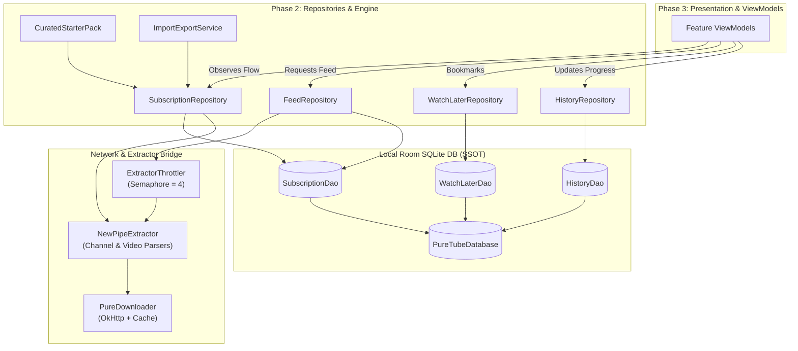

# Implementation Plan: Core Data Engine & Extractor (001-core-data-engine)

**Branch**: `001-core-data-engine` | **Date**: 2026-09-14 | **Spec**: [spec.md](file:///d:/b/puretube/specs/001-core-data-engine/spec.md)  
**Input**: Feature specification from `specs/001-core-data-engine/spec.md`  

---

## 1. Executive Summary & Value

Phase 2 builds the local-first, privacy-respecting data foundation and extraction core for PureTube (نَقِيّ). 
This layer connects Room SQLite database, NewPipeExtractor network extraction, and reactive repository contracts. 

Key technical deliverables:
1. **Room SQLite Database**: Tables and DAOs for `SubscriptionEntity`, `WatchLaterEntity`, and `HistoryEntity` with millisecond `Long` temporal accuracy and reactive Coroutine `Flow`.
2. **KSP & Room Compiler Configuration**: Adding `com.google.devtools.ksp` version `2.0.21-1.0.28` and `androidx.room:room-compiler:2.6.1` to enable compile-time verification.
3. **Resilient Network Extraction**: Wrapping NewPipeExtractor calls in `ExtractorThrottler` (`Semaphore(4)`) on `Dispatchers.IO` with an in-memory feed cache (15-minute TTL to re-query in background upon app reopening) and graceful error wrapping (`Result<T>`).
4. **Curated Safe Starter Pack**: In-memory and Room-seeded collection of beneficial starter channels (Quran, verified education, wholesome tech) automatically seeded on first launch if DB is empty to eliminate the blank-slate problem, with on-demand reactivation support.
5. **Subscription Portability**: Import/Export engine supporting NewPipe JSON and Google Takeout formats.
6. **Koin Dependency Injection**: Modular registration of `databaseModule` and `repositoryModule`.

---

## 2. Technical Context

- **Language/Version**: Kotlin 2.0.21 (JVM 17)
- **Primary Dependencies**:
  - AndroidX Room 2.6.1 (`room-runtime`, `room-ktx`, `room-compiler` via KSP)
  - Google KSP 2.0.21-1.0.28
  - NewPipeExtractor v0.24.4
  - OkHttp 4.12.0
  - Koin Android 3.5.6
  - Kotlinx Coroutines 1.8.1+
- **Storage**: Android Room SQLite with WAL (Write-Ahead Logging), single DB instance `PureTubeDatabase`
- **Testing**: JUnit 4, Kotlinx Coroutines Test, Room in-memory database tests (`Room.inMemoryDatabaseBuilder`)
- **Target Platform**: Android Mobile (minSdk 24, targetSdk 36)
- **Performance Goals**:
  - Room queries: < 10ms for local queries
  - Feed aggregation: < 3.5s for 10 channels concurrently
  - Peak memory during extraction: < 85MB
- **Constraints**:
  - Zero external telemetry or remote user accounts
  - Zero hardcoded colors (UI in later phase)
  - All files strictly under 1,000 LOC (< 300 LOC target)

---

## 3. Constitution Check

*GATE: Verified against PureTube Constitution v1.1.0*

- [x] **Gate 1: Anti-Addiction & Intentionality**: Zero recommendation tables, zero algorithmic trending. Content pulled exclusively from subscribed channels.
- [x] **Gate 2: AI Safety Hooks**: Preserved modular interfaces `VideoFrameHook` and `AudioFilterHook` with zero-copy NoOp defaults.
- [x] **Gate 3: Privacy & Offline-First SSOT**: Room DB is the sole SSOT for subscriptions, watch later, and history. Ephemeral streaming URLs isolated in-memory (never persisted in Room).
- [x] **Gate 4: Network Resilience & Temporal Precision**: `Semaphore(4)` concurrency throttling, all durations and seek offsets stored as `Long` milliseconds.
- [x] **Gate 5: File Length & Modular Blueprint**: Hard 1,000 LOC ceiling, 300 LOC target. Distinct DAOs, models, and repositories.
- [x] **Gate 6: Zero-Emoji & Theme Compliance**: System strings and logs strictly use Arabic typography and vector icons, zero Unicode emojis.
- [x] **Gate 7: Coroutines & Null-Safety Discipline**: Background work bound to `Dispatchers.IO`, zero `!!` operators, all network calls return `Result<T>`.

---

## 4. Architecture & Data Flow Diagram

---

## 5. Surgical File Changes Blueprint

### A. Build Configuration & Dependencies
1. **[MODIFY] [gradle/libs.versions.toml](file:///d:/b/puretube/gradle/libs.versions.toml)**:
   - Add `ksp = "2.0.21-1.0.28"` to `[versions]`.
   - Add `room-compiler = { group = "androidx.room", name = "room-compiler", version.ref = "room" }` to `[libraries]`.
   - Add `ksp = { id = "com.google.devtools.ksp", version.ref = "ksp" }` to `[plugins]`.
2. **[MODIFY] [build.gradle.kts](file:///d:/b/puretube/build.gradle.kts)**:
   - Add `alias(libs.plugins.ksp) apply false` to root plugins.
3. **[MODIFY] [app/build.gradle.kts](file:///d:/b/puretube/app/build.gradle.kts)**:
   - Apply `alias(libs.plugins.ksp)`.
   - Add `ksp(libs.room.compiler)` under dependencies.

---

### B. Room Database Layer (`com.dr.tech.puretube.core.database`)
4. **[NEW] [SubscriptionEntity.kt](file:///d:/b/puretube/app/src/main/java/com/dr/tech/puretube/core/database/entity/SubscriptionEntity.kt)**:
   - Room Entity `subscriptions`: `channelId` (PK), `channelName`, `channelHandle`, `avatarUrl`, `subscriberCountText`, `isNotificationsEnabled`, `subscribedAtMs`.
5. **[NEW] [WatchLaterEntity.kt](file:///d:/b/puretube/app/src/main/java/com/dr/tech/puretube/core/database/entity/WatchLaterEntity.kt)**:
   - Room Entity `watch_later`: `videoId` (PK), `title`, `channelId`, `channelName`, `thumbnailUrl`, `durationMs`, `addedAtMs`.
6. **[NEW] [HistoryEntity.kt](file:///d:/b/puretube/app/src/main/java/com/dr/tech/puretube/core/database/entity/HistoryEntity.kt)**:
   - Room Entity `playback_history`: `videoId` (PK), `title`, `channelId`, `channelName`, `thumbnailUrl`, `durationMs`, `lastPlaybackPositionMs`, `lastPlayedAtMs`, `isCompleted`.
7. **[NEW] [SubscriptionDao.kt](file:///d:/b/puretube/app/src/main/java/com/dr/tech/puretube/core/database/dao/SubscriptionDao.kt)**:
   - `getAllFlow(): Flow<List<SubscriptionEntity>>`
   - `getAll(): List<SubscriptionEntity>`
   - `isSubscribed(channelId: String): Flow<Boolean>`
   - `insert(entity: SubscriptionEntity)`
   - `insertAll(entities: List<SubscriptionEntity>)`
   - `deleteById(channelId: String)`
8. **[NEW] [WatchLaterDao.kt](file:///d:/b/puretube/app/src/main/java/com/dr/tech/puretube/core/database/dao/WatchLaterDao.kt)**:
   - `getAllFlow(): Flow<List<WatchLaterEntity>>`
   - `isInWatchLater(videoId: String): Flow<Boolean>`
   - `insert(entity: WatchLaterEntity)`
   - `deleteById(videoId: String)`
9. **[NEW] [HistoryDao.kt](file:///d:/b/puretube/app/src/main/java/com/dr/tech/puretube/core/database/dao/HistoryDao.kt)**:
   - `getRecentFlow(limit: Int = 100): Flow<List<HistoryEntity>>`
   - `getPlaybackPosition(videoId: String): Long?`
   - `upsert(entity: HistoryEntity)`
   - `updatePlaybackPosition(videoId: String, positionMs: Long, timestampMs: Long)`
   - `markCompleted(videoId: String)`
   - `clearAll()`
10. **[NEW] [PureTubeDatabase.kt](file:///d:/b/puretube/app/src/main/java/com/dr/tech/puretube/core/database/PureTubeDatabase.kt)**:
    - RoomDatabase subclass declaring the 3 entities and 3 DAOs, version 1.
11. **[NEW] [DatabaseModule.kt](file:///d:/b/puretube/app/src/main/java/com/dr/tech/puretube/core/database/di/DatabaseModule.kt)**:
    - Koin definitions for `PureTubeDatabase`, `SubscriptionDao`, `WatchLaterDao`, and `HistoryDao`.

---

### C. Curated Safe Packs & Portability
12. **[NEW] [CuratedStarterPack.kt](file:///d:/b/puretube/app/src/main/java/com/dr/tech/puretube/core/extractor/pack/CuratedStarterPack.kt)**:
    - Model & pre-vetted catalog: Quran recitations, verified Islamic lectures, educational content, tech tutorials, nature documentaries.
13. **[NEW] [ImportExportService.kt](file:///d:/b/puretube/app/src/main/java/com/dr/tech/puretube/core/extractor/portability/ImportExportService.kt)**:
    - Parser for NewPipe JSON subscription export.
    - Parser for Google Takeout CSV/JSON subscriptions.
    - Exporter generating offline backup JSON format.

---

### D. Repositories Layer (`com.dr.tech.puretube.core.data.repository`)
14. **[NEW] [SubscriptionRepository.kt](file:///d:/b/puretube/app/src/main/java/com/dr/tech/puretube/core/data/repository/SubscriptionRepository.kt)**:
    - Interface + Implementation: handles subscriptions in Room, resolves channel metadata via NewPipeExtractor, seeds starter pack, imports/exports.
15. **[NEW] [FeedRepository.kt](file:///d:/b/puretube/app/src/main/java/com/dr/tech/puretube/core/data/repository/FeedRepository.kt)**:
    - Aggregates channel uploads concurrently (limit 4 via `ExtractorThrottler`), sorts by upload timestamp descending, decorates with watch later status, caches in memory (TTL 15 mins).
16. **[NEW] [WatchLaterRepository.kt](file:///d:/b/puretube/app/src/main/java/com/dr/tech/puretube/core/data/repository/WatchLaterRepository.kt)**:
    - Adds/removes videos, exposes reactive Flow.
17. **[NEW] [HistoryRepository.kt](file:///d:/b/puretube/app/src/main/java/com/dr/tech/puretube/core/data/repository/HistoryRepository.kt)**:
    - Records playback start, updates millisecond progress, marks completed.
18. **[NEW] [RepositoryModule.kt](file:///d:/b/puretube/app/src/main/java/com/dr/tech/puretube/core/data/di/RepositoryModule.kt)**:
    - Koin module registering all repositories.

---

### E. App Registration & Wiring
19. **[MODIFY] [PureTubeApp.kt](file:///d:/b/puretube/app/src/main/java/com/dr/tech/puretube/PureTubeApp.kt)**:
    - Register `databaseModule` and `repositoryModule` into Koin `startKoin`.

---

## 6. Subagent Execution Decomposition

Following `/stop-think-search-and-plan`, once approved by the user, implementation will proceed through 4 specialized subagents:

| Subagent | Role & Scope | Responsibilities | Output & Verification |
|---|---|---|---|
| **Subagent 1** | **Build & Room Specialist** | KSP setup, `room-compiler`, Room entities, DAOs, `PureTubeDatabase`, `DatabaseModule` | `./gradlew compileDebugKotlin` and Room schema validation |
| **Subagent 2** | **Pack & Portability Specialist** | `CuratedStarterPack`, `ImportExportService` (NewPipe JSON & Takeout CSV parsers) | Unit tests verifying parsing accuracy on sample data |
| **Subagent 3** | **Repository & Extractor Specialist** | `SubscriptionRepository`, `FeedRepository` with `Semaphore(4)` concurrency, `WatchLaterRepository`, `HistoryRepository`, `RepositoryModule` | Unit tests verifying throttling, error wrapping, Flow emission |
| **Subagent 4** | **Neutral Auditor & Quality Gate** | CodeRabbit-grade audit: null safety, coroutine dispatchers, memory leaks, Constitution compliance | `./gradlew test` and `./gradlew assembleDebug` with 0 errors |

---

## 7. Verification & Automated Testing Plan

1. **Room In-Memory Tests**:
   - `SubscriptionDaoTest`: Insert, delete, Flow emissions, duplicate ignore.
   - `WatchLaterDaoTest`: Add, query, remove.
   - `HistoryDaoTest`: Upsert, update position in ms, complete video.
2. **Extractor & Throttler Tests**:
   - Verify `ExtractorThrottler` never exceeds 4 concurrent tasks under load.
   - Verify timeout and `Result.failure` on simulated socket timeouts.
3. **Import/Export Unit Tests**:
   - Parse sample NewPipe JSON with 10 channels.
   - Parse sample Google Takeout CSV with 10 channels.
   - Verify full channel fidelity and zero missing keys.
4. **Build Verification**:
   - `./gradlew test` (All unit tests pass)
   - `./gradlew assembleDebug` (0 compilation errors, clean APK generation)
