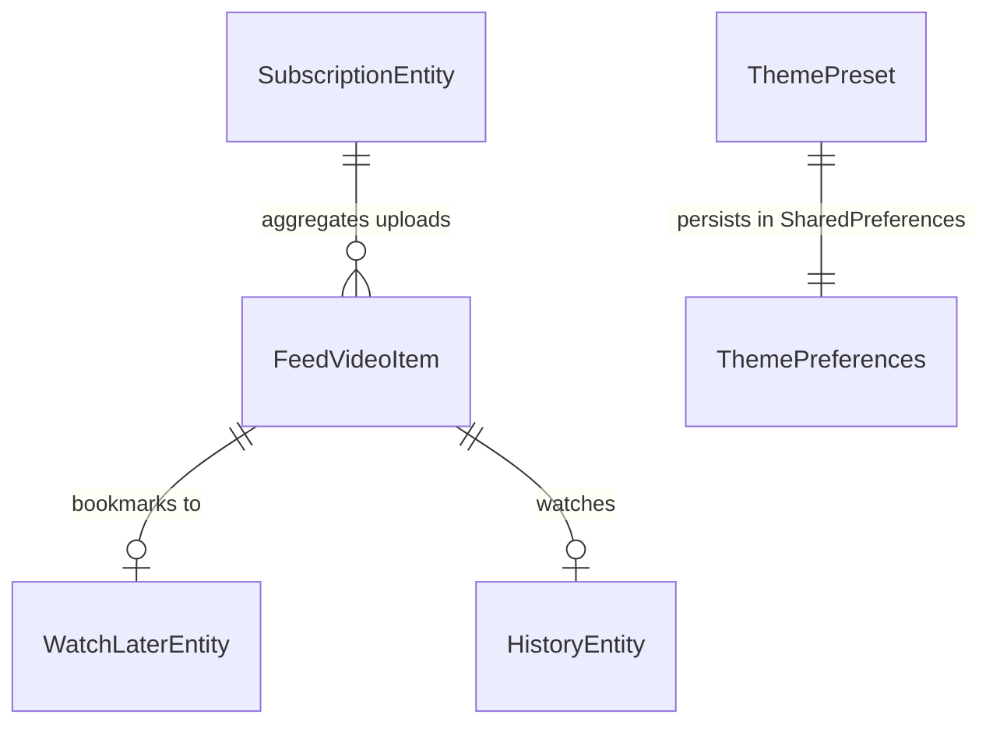

# Data Model & State Contracts: UI & Navigation (002-ui-and-navigation)

**Feature**: UI & Navigation Shell  
**Created**: 2026-09-15  
**Status**: Completed  

---

## 1. Navigation Domain Model

### PureNavTab (Enum)
Represents the top-level screens in the permanent bottom navigation bar:

```kotlin
enum class PureNavTab(
    val titleArabic: String,
    val iconSelected: ImageVector,
    val iconUnselected: ImageVector
) {
    FEED(
        titleArabic = "الرئيسية",
        iconSelected = Icons.Filled.DynamicFeed,
        iconUnselected = Icons.Outlined.DynamicFeed
    ),
    SUBSCRIPTIONS(
        titleArabic = "الاشتراكات",
        iconSelected = Icons.Filled.Subscriptions,
        iconUnselected = Icons.Outlined.Subscriptions
    ),
    WATCH_LATER(
        titleArabic = "المشاهدة لاحقاً",
        iconSelected = Icons.Filled.Bookmark,
        iconUnselected = Icons.Outlined.BookmarkBorder
    ),
    SETTINGS(
        titleArabic = "الإعدادات",
        iconSelected = Icons.Filled.Settings,
        iconUnselected = Icons.Outlined.Settings
    )
}
```

---

## 2. Screen State Models (Immutable UI States)

### A. FeedUiState
```kotlin
data class FeedUiState(
    val isLoading: Boolean = false,
    val isRefreshing: Boolean = false,
    val videos: List<FeedVideoItem> = emptyList(),
    val errorMessage: String? = null,
    val isEmptySubscriptions: Boolean = false
)
```

### B. SubscriptionsUiState
```kotlin
data class SubscriptionsUiState(
    val isLoading: Boolean = false,
    val isAddingChannel: Boolean = false,
    val isActivatingPack: Boolean = false,
    val isImporting: Boolean = false,
    val subscriptions: List<SubscriptionEntity> = emptyList(),
    val errorMessage: String? = null,
    val userNoticeMessage: String? = null,
    val channelPendingUnsubscribe: SubscriptionEntity? = null
)
```

### C. WatchLaterUiState
```kotlin
data class WatchLaterUiState(
    val isLoading: Boolean = false,
    val items: List<WatchLaterEntity> = emptyList(),
    val errorMessage: String? = null
)
```

### D. SettingsUiState
```kotlin
data class SettingsUiState(
    val currentPreset: ThemePreset = ThemePreset.EMERALD_NIGHT,
    val subscriptionCount: Int = 0,
    val watchLaterCount: Int = 0,
    val historyCount: Int = 0,
    val appVersion: String = "1.0.0"
)
```

---

## 3. Entity Relationships & Room DB Mapping



- **SubscriptionEntity**: Authoritative local table in Room SQLite for intentional channel follows.
- **WatchLaterEntity**: Authoritative local table in Room SQLite for mindful postponed viewing.
- **HistoryEntity**: Authoritative local table in Room SQLite for playback offsets in milliseconds.
- **ThemePreferences**: Lightweight persistence key-value storage for the selected `ThemePreset`.
